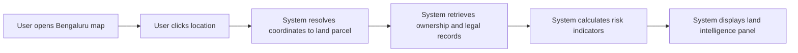

# MyLiege — Product Requirements Document

---

## Discovery Summary

### Known Decisions

| Aspect | Decision |
|--------|----------|
| **Product** | Map-based land intelligence platform |
| **Geography** | Bengaluru |
| **Primary User** | Individual land buyers |
| **Core Job** | Verify ownership, legal risks, and last sale price before contacting a seller |
| **MVP Flow** | Map click → Parcel detection → Fetch records → Show ownership + risk summary |
| **Constraint** | Solo project |

### Key Performance Indicators

- Weekly land searches
- Verification reports generated
- Returning users

### Open Questions

None critical for PRD v1

### Assumptions

- Web-based application
- Survey parcel GIS data exists for Bengaluru
- Records accessible from government systems
- Risk engine interprets land records

---

## Contents

1. [Abstract](#abstract)
2. [Business Objectives](#business-objectives)
3. [KPI](#kpi)
4. [Success Criteria](#success-criteria)
5. [User Journeys](#user-journeys)
6. [Scenarios](#scenarios)
7. [User Flow](#user-flow)
8. [Functional Requirements](#functional-requirements)
9. [Model Requirements](#model-requirements)
10. [Data Requirements](#data-requirements)
11. [Prompt Requirements](#prompt-requirements)
12. [Testing & Measurement](#testing--measurement)
13. [Risks & Mitigations](#risks--mitigations)
14. [Costs](#costs)
15. [Assumptions & Dependencies](#assumptions--dependencies)
16. [Compliance/Privacy/Legal](#complianceprivacylegal)
17. [GTM/Rollout Plan](#gtmrollout-plan)

---

## 📝 Abstract

A web platform that allows users to click any location in Bengaluru on a map and instantly view verified land intelligence including ownership, legal encumbrances, land type, and past sale price. The goal is to reduce fraud and uncertainty in land transactions by making land records easy to discover and interpret.

---

## 🎯 Business Objectives

- Increase transparency in Bengaluru land ownership records
- Help buyers identify legal risks before engaging sellers
- Reduce time required for land verification
- Build trust through verified data aggregation

---

## 📊 KPI

| Goal | Metric | Question |
|------|--------|----------|
| **Product Usage** | Land Searches per Week | Are users actively investigating land parcels? |
| **Value Delivered** | Verification Reports Generated | Are users relying on the product for decisions? |
| **Retention** | Returning Users | Do users repeatedly check new land locations? |

---

## 🏆 Success Criteria

- Users can retrieve land intelligence within **10 seconds**
- At least **100+ land lookups per week** during early testing
- Positive user feedback indicating improved confidence in land verification
- Early adoption among buyers and small brokers

---

## 🚶‍♀️ User Journeys

### Buyer Journey

> A user hears about a land parcel from a broker. Instead of blindly trusting the information, the user opens the platform, finds the location on the map, clicks the parcel, and immediately sees ownership details and legal signals that help them decide whether the land is worth investigating.

---

## 📖 Scenarios

| # | Scenario |
|---|----------|
| 1 | Buyer checking if land is already legally owned |
| 2 | Buyer checking encumbrance or loan status |
| 3 | Buyer checking past sale transaction price |
| 4 | Buyer evaluating multiple plots in a region |

---

## 🕹️ User Flow

### Happy Path

**Step-by-step:**

1. User opens Bengaluru map
2. User clicks location
3. System resolves coordinates to land parcel
4. System retrieves ownership and legal records
5. System calculates risk indicators
6. System displays land intelligence panel

---

## 🧰 Functional Requirements

| Section | Sub-Section | User Story & Expected Behaviors | Screens |
|---------|-------------|--------------------------------|---------|
| **Map** | Land Discovery | User clicks location and system detects parcel | Map View |
| **Parcel Identification** | Geo Resolver | System maps coordinates to survey parcel | Backend |
| **Record Retrieval** | Land Records | Fetch ownership, land type, and encumbrance | Data Service |
| **Risk Engine** | Legal Analysis | System interprets legal records and produces summary | Risk Panel |
| **Land Intelligence** | Results Panel | Show owner name, risk status, and last sale price | Land Info Panel |

---

## 📐 Model Requirements

| Specification | Requirement | Rationale |
|---------------|-------------|-----------|
| **Open vs Proprietary** | Open preferred | Lower cost for solo project |
| **Context Window** | Medium | Summarize land records |
| **Modalities** | Text | Interpret government records |
| **Fine Tuning Capability** | Not required initially | Use retrieval methods |
| **Latency** | P50 < 5s | Maintain responsive map experience |

---

## 🧮 Data Requirements

### Primary Sources

- Karnataka Bhoomi Land Records
- Kaveri Online Services

### Required Datasets

| Dataset | Description |
|---------|-------------|
| Survey parcel GIS polygons | Spatial boundaries for land parcels |
| RTC ownership records | Rights, Tenancy, and Crops records |
| Encumbrance certificates | Legal liabilities on land |
| Sale transaction history | Past transaction prices |

### Data Preparation

- Normalize land identifiers
- Link survey numbers with spatial polygons

---

## 💬 Prompt Requirements

- AI summarization of land records
- Structured outputs (ownership, risk level, transaction history)
- Clear explanations for non-expert users
- Avoid legal interpretation beyond available records

---

## 🧪 Testing & Measurement

### Offline Testing

- Validate parcel detection accuracy
- Compare extracted ownership data with official records

### Online Monitoring

- Track search latency
- Monitor failed record retrieval
- Track report generation frequency

---

## ⚠️ Risks & Mitigations

| Risk | Mitigation |
|------|------------|
| Government land data not accessible | Use public record scraping or partnerships |
| Parcel boundaries unavailable | Use cadastral datasets or satellite mapping |
| Users mistrust automated analysis | Provide source references in reports |

---

## 💰 Costs

### Development

| Cost Item | Description |
|-----------|-------------|
| Map APIs | Mapping service integration |
| Data ingestion pipelines | ETL for land records |
| Backend infrastructure | Server and database setup |

### Operational

| Cost Item | Description |
|-----------|-------------|
| Map hosting | Tile server and spatial data |
| Compute for queries | Query processing |
| Optional AI inference | LLM for summarization |

---

## 🔗 Assumptions & Dependencies

- Survey polygon dataset available
- Land records accessible programmatically
- Map provider supports parcel overlays
- Legal interpretation limited to data summarization

---

## 🔒 Compliance/Privacy/Legal

- Use only **publicly available land records**
- Avoid storing personally sensitive data beyond public ownership records
- Include **disclaimer** that tool provides informational assistance only

---

## 📣 GTM/Rollout Plan

| Phase | Name | Activities |
|-------|------|------------|
| **Phase 1** | Prototype | Internal testing with limited Bengaluru parcels |
| **Phase 2** | Beta | Invite early land buyers and brokers |
| **Phase 3** | Public Launch | Public map portal for Bengaluru land intelligence |

---