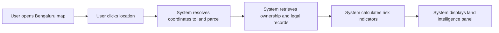

# MyLiege

A map-based land intelligence platform for Bengaluru that helps land buyers verify ownership, legal risks, and sale prices before contacting sellers.

## Overview

MyLiege allows users to click any location in Bengaluru on a map and instantly view verified land intelligence including:

- **Ownership details** - Current registered owner information
- **Legal encumbrances** - Outstanding loans, liens, or legal disputes
- **Land type** - Classification and zoning information
- **Past sale price** - Transaction history and pricing trends

## Problem

Land transactions in Bengaluru often involve:
- Unclear ownership records
- Undisclosed legal encumbrances
- Fraudulent sale claims
- Time-consuming verification processes

## Solution

MyLiege aggregates publicly available land records and presents them through an intuitive map interface, reducing fraud and uncertainty in land transactions.

## Key Features

| Feature | Description |
|---------|-------------|
| Map Discovery | Click any location on the Bengaluru map to identify land parcels |
| Parcel Detection | Automatic resolution of coordinates to survey parcel boundaries |
| Ownership Verification | Retrieve and display current ownership records |
| Risk Assessment | AI-powered analysis of legal encumbrances and risks |
| Transaction History | View past sale prices and transaction records |

## User Flow

## Data Sources

- **Karnataka Bhoomi Land Records** - Official land records system
- **Kaveri Online Services** - Government registration portal
- **Survey parcel GIS polygons** - Spatial boundary data
- **RTC records** - Rights, Tenancy, and Crops documentation

## Technology Stack

*To be defined during development*

## Roadmap

| Phase | Description |
|-------|-------------|
| **Prototype** | Internal testing with limited Bengaluru parcels |
| **Beta** | Invite early land buyers and brokers |
| **Public Launch** | Public map portal for Bengaluru land intelligence |

## Getting Started

*Development setup instructions to be added*

## License

*License to be determined*

---

**Note:** This tool provides informational assistance only. Always verify land records through official government channels before making purchase decisions.